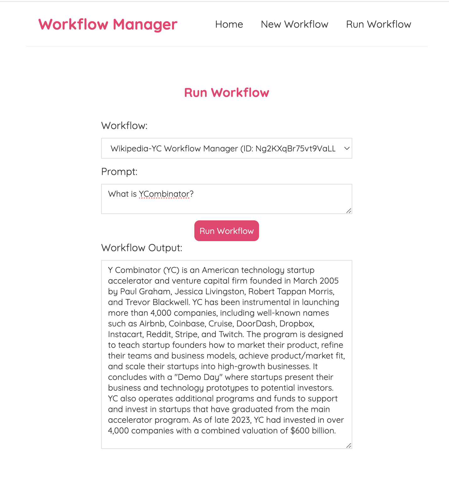
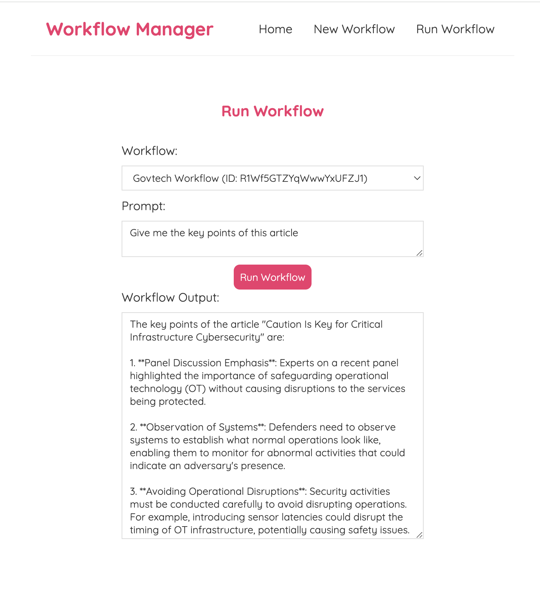
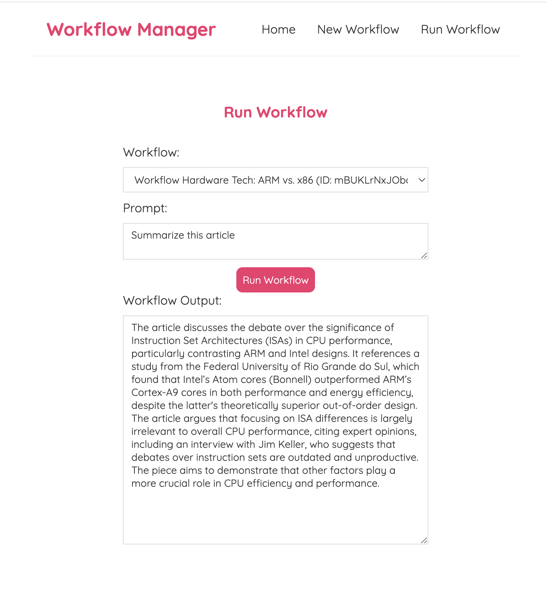
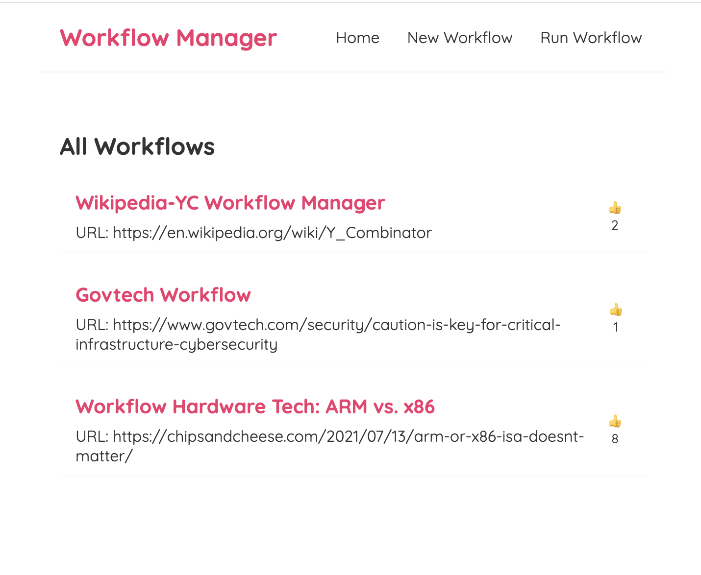
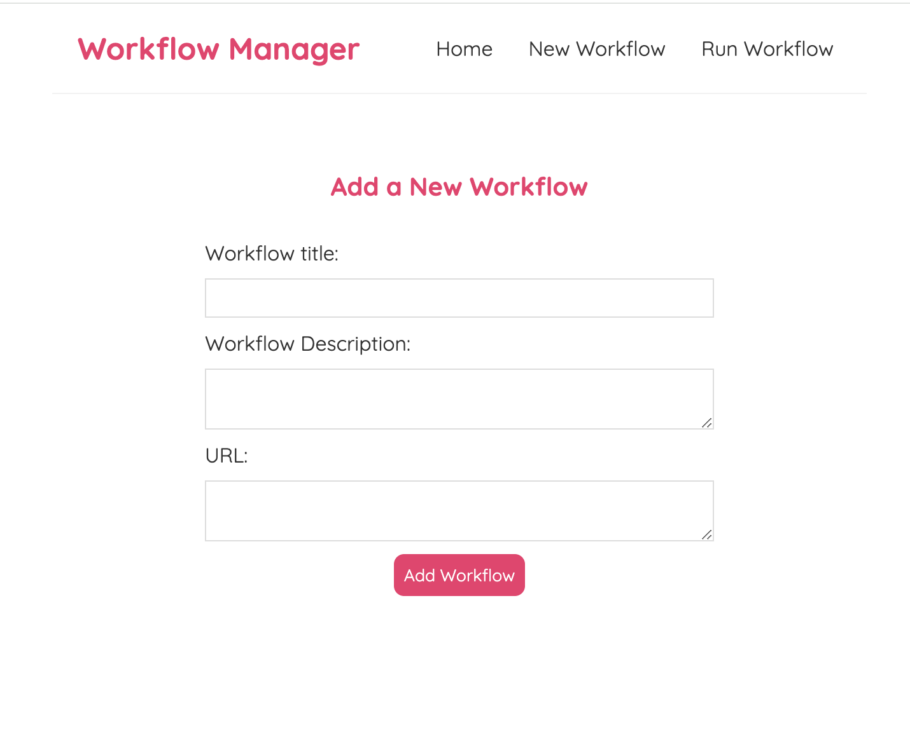
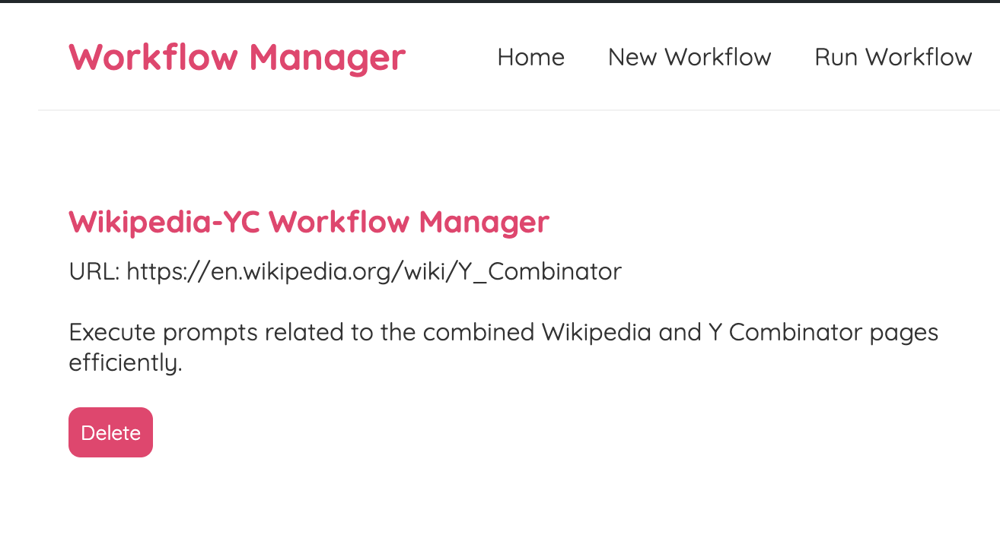

# Workflow Management Web Application

The objective of this project is to develop a comprehensive workflow management application using React with TypeScript, FastAPI, and LangChain.

# Table of Contents

- [Assumptions](#assumptions)
- [Installation & Usage](#installation--usage)
  - [Backend](#backend)
  - [Frontend](#frontend)
- [Explanation](#explanation)
  - [Frontend](#frontend-1)
  - [Backend](#backend-1)
    - [FastAPI](#fastapi)
    - [AI Integration](#ai-integration)
- [Improvements](#improvements)
- [Screenshots](#screenshots)

# Assumptions
- URLs provided by the user are valid.
- The main source of information from the URL is text. For example, YouTube videos and images are not considered sources of information (this is further addressed in the Improvements section).
- No edits are needed after the creation of a workflow.

# Installation & Usage

## Backend

**Python v3.10.11**

The following commands creates a pyenv with the packages and runs the backend.
```bash
cd backend
chmod +x start_backend.sh
bash start_backend.sh
```

If you already have your own pyenv with the packages, you can just run:

```bash
cd backend/app
uvicorn main:app --reload
```


## Frontend

**npm 10.8.1**

The following commands install the packages and runs the frontend.
```bash
cd frontend
chmod +x start_frontend.sh
bash start_frontend.sh
```

If you just want to run the frontend:
```bash
cd frontend
npm start
```


# Explanation

## Frontend

The frontend of the application is built with React and TypeScript. It features several components designed to manage workflows through a variety of actions such as creation, execution, and deletion. Each workflow is defined by the following TypeScript type:

```typescript
type Workflow = {
    url: string;
    title: string;
    id: string;
    body: string;
};
```
Below is a description of each component:

- **Create.tsx**: Responsible for creating a new workflow. It interacts with the backend via the `POST /workflow` endpoint.

- **RunWorkflow.tsx**: Manages the execution of a created workflow and displays the output to the user. It communicates with the backend through the `POST /workflows/{id}/execute` endpoint.

- **WorkflowDetails.tsx**: Allows the user to select and view detailed information about a specific workflow. It fetches data from the `GET /workflows/{id}` endpoint and provides functionality to delete the workflow via the `DELETE /workflows/{id}` endpoint.

- **WorkflowList.tsx**: Lists all existing workflows by querying the `GET /workflows` endpoint.

- **Home.tsx**: Combines all other components to create the main view of the application.

- **Navbar.tsx**: Provides navigation between different pages of the application.

In addition to these components, I also included a reaction button on each workflow card to allow users to "like" a workflow. For managing this feature, I used Redux for state management.


## Backend

For the database, I use Firebase to create a collection for storing all data due to its speed, affordability, scalability, and user-friendly NoSQL architecture. Firebase’s self-hosted nature makes it convenient for sharing; interviewers can easily access and utilize the data without additional setup, streamlining the demonstration process.

### FastAPI
Since the backend utilizes third-party tools like Firebase and OpenAI, all credentials are stored in a `.env` file for easy management. (**Note**: *For the purpose of the interview, I am temporarily including my private keys for code review and testing. These keys will be removed immediately after the interview process is completed to ensure security.*)

All the endpoints can be found on file `router.py`, containing each endpoint 

**Get Workflow by ID**
- **Endpoint**: `GET /workflows/{id}`
- **Description**: Retrieves a specific workflow document from Firestore using the provided `id`. Returns the workflow's details if the document exists.

**Get All Workflows**
- **Endpoint**: `GET /workflows`
- **Description**: Fetches a list of all workflow documents from Firestore. Returns a list of workflows with their details.

**Create Workflow**
- **Endpoint**: `POST /workflows`
- **Description**: Creates a new workflow document in Firestore using the provided workflow data. Returns a success message upon creation.

**Delete Workflow by ID**
- **Endpoint**: `DELETE /workflow/{id}`
- **Description**: Deletes a specific workflow document from Firestore using the provided `id`. Returns a success message upon deletion.

**Execute Workflow**
- **Endpoint**: `POST /workflow/{id}/execute`
- **Description**: Executes a workflow by fetching its details from Firestore using the provided `id`. Uses the `RAGPipeline` to process a prompt with the workflow's associated URL. Returns the result of the execution.

### AI Integration

For the AI pipeline, I chose OpenAI's GPT-4o model due to its high performance and cost-effectiveness, combined with LangChain for enhanced functionality. Each document is processed in chunks and stored in the Chroma vector database, enabling efficient search based on user prompts.

To ensure modularity and ease of use, I implemented the solution using object-oriented programming. The core class, `RAGPipeline`, manages the loading, chunking, and searching of data. This approach allows for flexible modifications to components like `DocumentLoader`, `TextSplitter`, and `VectorStore` without affecting the overall system.

By structuring the code in this manner, we achieve a clean and maintainable architecture that supports easy updates and extensions.

You can also find a folder `notebooks` which was used for testing.


# Improvements

Just like any software code, there is always room for improvement. Due to time constraints, there are several potential enhancements that could be made:

- **URL Validation**: Currently, the system assumes that users will provide valid URLs. An improvement would be to implement URL validation to ensure correctness. Additionally, the project could be expanded to handle more diverse input types, such as YouTube transcripts. For example, users could upload a YouTube link, and the AI could extract the transcript and provide responses based on this context.

- **Data Preprocessing**: Another important improvement would be to chunk and store the data beforehand, rather than performing these operations only during the 'Run' execution of the workflow. This change could enhance performance significantly. However, since the current process takes approximately 3 seconds to chunk and return data via the LLM, this approach was deemed acceptable for this assignment.

- **Data Loading and Filtering**: For loading data, I used LangChain's `WebBaseLoader`, which works well for many websites. However, it may return excessive or irrelevant text (e.g., image captions, footnotes) when dealing with complex websites that contain numerous HTML tags and images. An improvement would be to filter the text to include only specific tags, such as `<p>` tags. This approach would need to be tested to ensure it works across a variety of websites and minimizes the inclusion of unnecessary content.

# Screenshots

### Run Workflow




### Home


### Create Workflow


### Workflow Details

